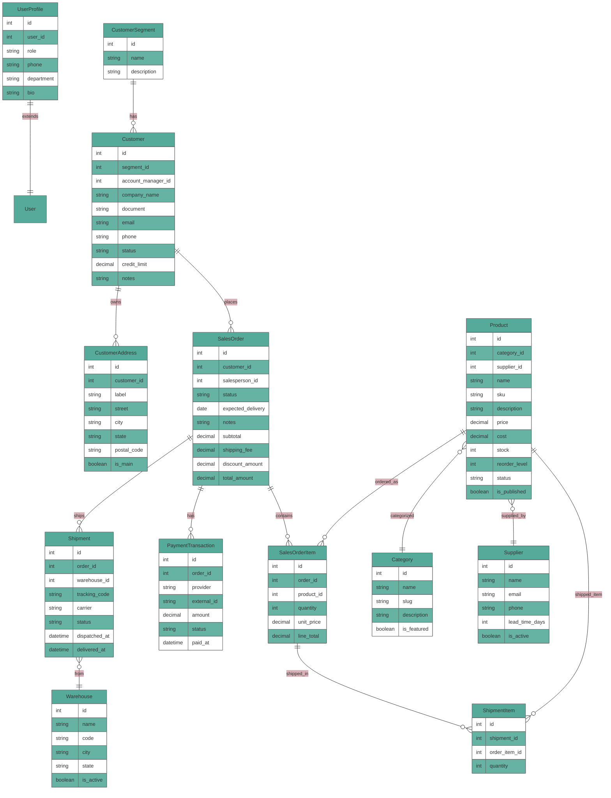

# Backend DRF de Marketplace B2B

Projeto de referência para API REST em Django REST Framework com foco em domínio de vendas B2B.

Como é um projeto de estudos eu deixei comentado em absolutamente todo lugar para não me perder durante o aprendizado, pois foi um aprendizado interrompido frequentemente.

Principais recursos:
- autenticação (token/session) + perfil de usuário
- módulo de clientes, produtos, pedidos, pagamento e shipping
- fluxo de pedido com transições de estado e controle de estoque
- validações de integridade de dados e regras de negócio centralizadas

## Documentação

- Arquitetura: `docs/ARCHITECTURE.md`
- Endpoints e contratos: `docs/API.md`
- Swagger UI: `/swagger/`
- ReDoc: `/redoc/`

## Variáveis de ambiente

- copie `example.env` para `.env` e ajuste os valores.


## Diagrama MER/DER (Mermaid)



## Rotas da API

### Autenticação (`/api/v1/accounts/`)
- `POST /login/` -> token auth (obter credenciais)
- `POST /users/` -> criar usuário com perfil padrão
- `GET /me/` -> dados do usuário logado

### Clientes (`/api/v1/customers/`)
- `GET/POST /segments/` (segmentos de clientes)
- `GET/PUT/PATCH/DELETE /segments/{id}/`
- `GET/POST /customers/` (clientes)
- `GET/PUT/PATCH/DELETE /customers/{id}/`
- `GET/POST /addresses/` (endereços de clientes)
- `GET/PUT/PATCH/DELETE /addresses/{id}/`

### Produtos (`/api/v1/products/`)
- `GET/POST /categories/`, `/suppliers/`, `/products/`
- `GET/PUT/PATCH/DELETE /categories/{id}/`, `/suppliers/{id}/`, `/products/{id}/`
- `POST /products/{id}/adjust_stock/` (ajuste de estoque via serializer customizado)

### Pedidos (`/api/v1/orders/`)
- `GET/POST /orders/` (pedido com items em JSON aninhado)
- `GET/PUT/PATCH/DELETE /orders/{id}/`
- `GET/POST /payments/` (transacoes de pagamento)
- `GET/PUT/PATCH/DELETE /payments/{id}/`

### Shipping (`/api/v1/shipping/`)
- `GET/POST /warehouses/` (armazens)
- `GET/PUT/PATCH/DELETE /warehouses/{id}/`
- `GET/POST /shipments/` (envios)
- `GET/PUT/PATCH/DELETE /shipments/{id}/`

## Regras de Negócio do Marketplace

1. cliente precisa ter `CustomerSegment` e pode estar `lead`, `active` ou `inactive`.
2. pedido é criado em `draft` e evolui para `confirmed`, `paid`, `shipped` ou `cancelled`.
3. total do pedido é `subtotal + shipping_fee - discount_amount`; `items` devem corresponder a produtos ativos e estoque suficiente.
4. `Product.needs_restock == stock <= reorder_level` alerta operações para compra.
5. pagamento registra `pending`/`approved`/`failed`; só ao `approved` o pedido deve ser movido a `paid`.
6. remessa é associada a pedido e armazem, com status `pending`/`picking`/`in_transit`/`delivered`.

## Como executar

```bash
cd core
..\venv\Scripts\python manage.py migrate
..\venv\Scripts\python manage.py createsuperuser
..\venv\Scripts\python manage.py runserver
```
