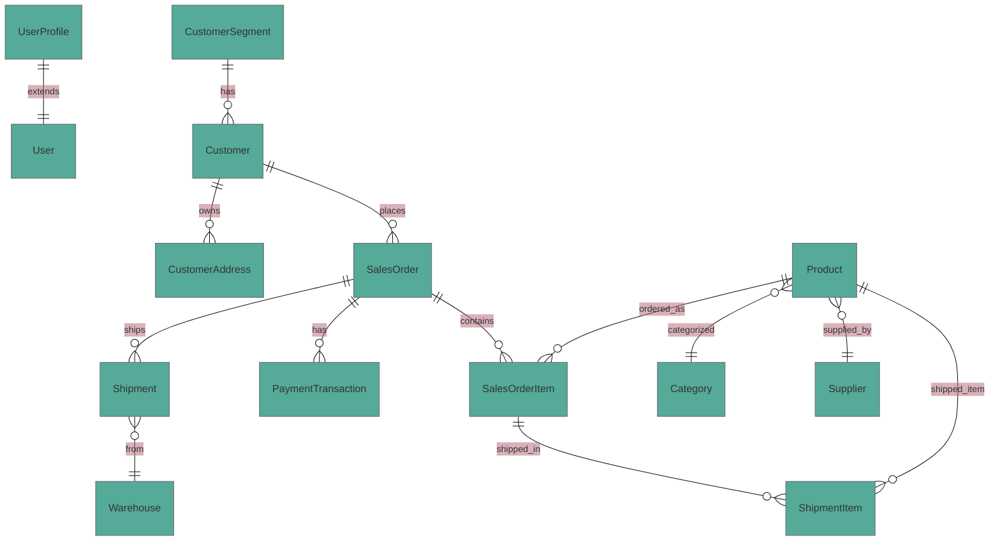

# Arquitetura do Marketplace B2B

Esta documentação descreve as entidades, relacionamentos e regras estruturais do backend.

## Visão geral

- Módulos desacoplados: `accounts`, `customers`, `products`, `orders`, `shipping`, `common`.
- API expõe recursos REST via `routers` do Django REST Framework.
- Modelos usam `TimeStampedModel` comum para `created_at`/`updated_at`.

## Modelo de domínio (MER/DER)

## Restrições de modelo principais

- `CustomerAddress` tem restrição única por `customer` e `is_main=True`.
- Transições de status de `SalesOrder` são controladas programaticamente em `SalesOrder.transition_to`.
- Pagamentos aprovados acionam transição de pedido para `paid`.
- `SalesOrderItem` valida estoque e disponibilidade do produto antes de criar.
